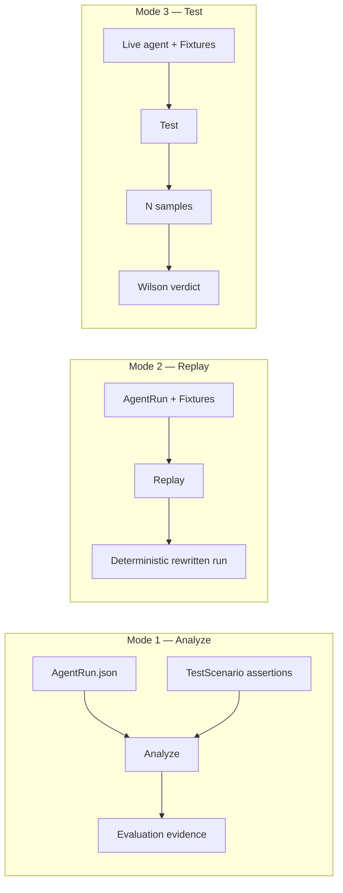

# Execution Modes

gust never blurs Analyze, Replay, and Test. Each answers a different question.

## Mode 1 — Analyze

**Question:** Did this captured trajectory satisfy the assertions?

- Input: `AgentRun` + assertions
- Process: Dispatch each assertion to a registered deterministic evaluator
- Output: Per-assertion evidence and aggregate pass/fail
- Side effects: None (offline, no LLM)

## Mode 2 — Replay

**Question:** What happens if we re-apply recorded tool responses (and optional failure modes) to this trajectory structure?

- Input: `AgentRun` + fixture provider
- Process: Replace tool span outputs from fixtures; support sequence and hash matching
- Output: Deterministic rewritten run (stable under repeated replay)
- Side effects: Local fixture lookup only

Replay is also the substrate for **mutation testing**: mutators alter traces; Analyze detects whether assertions fail.

## Mode 3 — Test

**Question:** Is *today’s* live agent reliable on this scenario?

- Input: `TestScenario` + `TestRunner` + fixture endpoint
- Process: Run the agent *N* times in parallel (bounded workers); evaluate each sample; compute Wilson interval
- Output: `ReliabilityResult` with `PASS` / `FAIL` / `FLAKY` / `INSUFFICIENT_SAMPLES`
- Side effects: Invokes real agent/LLM (or a synthetic runner for statistical proofs)

## Policy layer

Policy sits **above** raw evaluation. It combines hard constraints (zero-tolerance), soft reliability thresholds, `on_flaky` behavior, and optional baseline-vs-candidate regression into CI exit codes.

