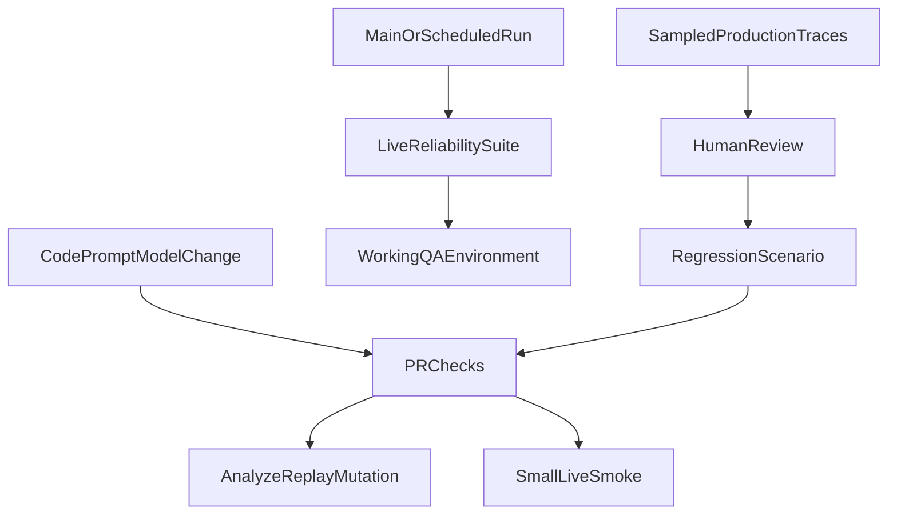
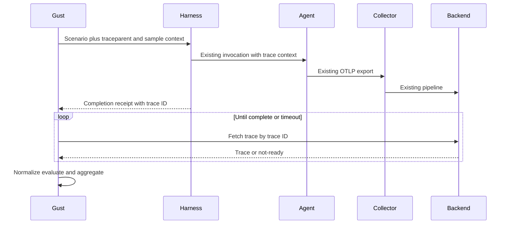

# Execution topologies

Where Gust runs, who triggers the agent, and how traces come back.

## Recommended schedule



| Cadence | What to run | Why |
|---------|-------------|-----|
| Every PR | `gust analyze` / `replay` / `mutate` + optional small live smoke | Fast, cheap, deterministic |
| Main / nightly | `gust test` with larger N | Real reliability signal |
| Pre-release | Critical suite + `gust compare` baseline | Catch regressions |
| Production | Sample traces → `scenario from-run` → human assertions | Grow the suite from reality |

Gust is never a production sidecar.

## Topology matrix

| Topology | Trigger | World control | Observation | Status |
|----------|---------|---------------|-------------|--------|
| Same CI/laptop job | `--runner exec` | existing or gust | stdout AgentRun or in-process OTLP | **Supported** |
| HTTP agent on localhost / VPC | `--runner http` | existing or gust (same host) | response / OTLP | **Supported** |
| Jenkins / self-hosted in QA network | exec/http/trigger | existing; gust if same host | OTLP to routable listener or response | **Supported** |
| Remote QA cannot dial CI | `--runner http --trace-source response` | existing | AgentRun in `/invoke` body | **Supported** |
| Remote QA + existing OTel backend | `--runner trigger` + `--trace-fetch-command` | existing | Fetch by known `{trace_id}` | **Supported** (generic command) |
| Integration suite owns execution | `--runner trigger` wrapping pytest/etc. | existing | receipt / fetch / OTLP | **Supported** |
| Gust fixtures for remote QA | — | gust across network | — | **Not in this milestone** (loopback proxy) |
| Native Tempo/Jaeger/Phoenix adapters | — | — | vendor query APIs | **Deferred**; use fetch command |

## Remote QA (no Gust code in the agent)



Prerequisites:

1. The trigger can propagate W3C `traceparent` / `baggage` (or otherwise learn the resulting trace id).
2. Existing instrumentation continues that trace.
3. CI can query the backend (CLI/API) and print an `AgentRun` or OTLP export for `{trace_id}`.

Example:

```bash
gust test evals/ \
  --runner trigger \
  --trace-fetch-command 'my-trace-cli get {trace_id}' \
  --samples 20 \
  -- -- python harness/run_one_qa_case.py
```

The harness prints an execution receipt (`{"status":"completed","trace_id":"..."}`) or an inline AgentRun. Gust polls the fetch command until the trace is ready.

## GitHub Actions / Jenkins notes

- Upload `gust-report.html` as a CI artifact.
- Prefer same-job `exec` for PR smoke; reserve remote QA for nightly.
- GitHub-hosted runners have no inbound ports — use `--trace-source response` or trigger+fetch, not OTLP push into the runner.
