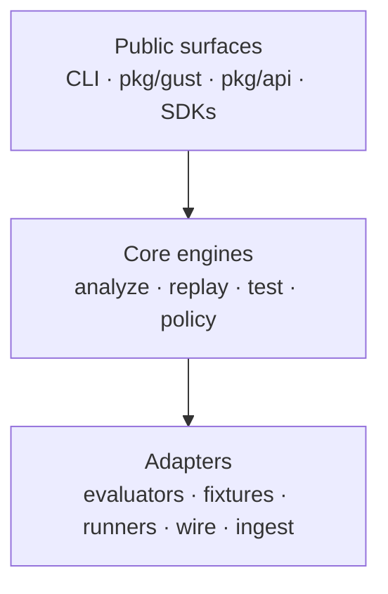

# Hexagonal design

Gust separates **what to evaluate** from **how to invoke agents and I/O**, so the CLI, SDKs, and library API share one behavioral core.

## What application code should use

| Package | Role |
|---------|------|
| `pkg/api` | Domain types (`AgentRun`, assertions, results) |
| `pkg/gust` | Stable Go library API (Analyze + custom evaluators) |
| `pkg/jcs` | Canonical JSON hashing helpers |
| `sdk/python`, `sdk/typescript` | Record runs and Mode 3 hooks |

Do **not** import `gust/internal/...` from application modules — those packages are implementation details and may change without notice. See [Go library]().

## Why this shape

- Deterministic Analyze/Replay stay free of network and LLM SDKs.
- Mode 3 runners and fixture proxies are swappable adapters behind the CLI.
- Cross-language plugins speak a narrow wire protocol instead of linking into Go.

Contributor-oriented package layout lives in the repository tree (`cmd/`, `pkg/`, `internal/`). End-user workflows are documented under [Usage]() and [Extending]().
