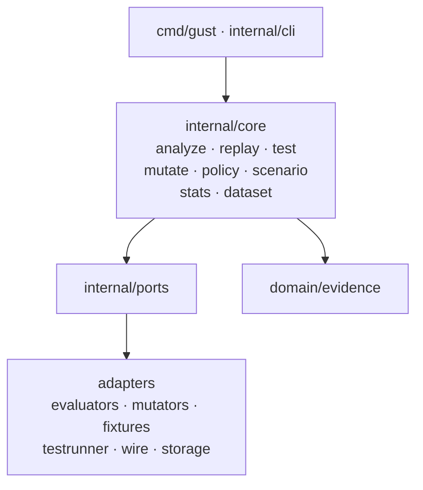

# Hexagonal Design

gust uses ports & adapters so domain logic stays free of I/O frameworks and LLM SDKs.



## Layers

| Layer | Packages | Responsibility |
|-------|----------|----------------|
| **Public API** | `pkg/api`, `pkg/jcs` | Domain types, validation, canonical hashing |
| **Ports** | `internal/ports` | `Evaluator`, `Mutator`, `FixtureProvider`, `TestRunner`, stores |
| **Core** | `internal/core/*` | Use cases: modes, stats, policy, extraction |
| **Adapters** | `internal/adapters/*` | Built-in implementations and I/O |
| **Entry** | `cmd/gust`, `cmd/gust-aee`, `internal/cli` | End-user Cobra CLI; internal self-benchmark CLI |

## Package map (MVP)

```text
gust/
├── cmd/gust/
├── pkg/api/
├── pkg/jcs/
├── internal/
│   ├── ports/
│   ├── registry/
│   ├── domain/evidence/
│   ├── core/
│   │   ├── analyze/
│   │   ├── replay/
│   │   ├── test/
│   │   ├── stats/
│   │   ├── mutate/
│   │   ├── policy/
│   │   ├── scenario/
│   │   └── dataset/
│   ├── adapters/
│   │   ├── evaluators/
│   │   ├── mutators/
│   │   ├── fixtures/
│   │   ├── ingest/otel · langfuse
│   │   ├── testrunner/
│   │   ├── wire/
│   │   └── storage/filesystem/
│   └── cli/
└── spec/schemas/
```

## Concurrency

Mode 3 sampling uses a bounded worker pool. When the fixture provider is clonable (the built-in memory provider is), each sample gets a cloned provider and an ephemeral mock-tool proxy so ordered fixture sequences cannot interleave. Non-clonable providers with ordered fixtures fall back to `concurrency=1`. All blocking APIs take `context.Context` for cancellation.

