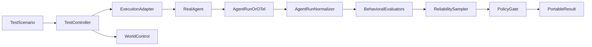

# How Gust works

Gust is a **dataset-driven behavioral evaluation harness**. It does not replace your agent framework, mocks, or observability backend. It coordinates four independent concerns:

| Concern | Gust role | Typical owner |
|---------|-----------|---------------|
| Trigger | Start one sample | `exec` / `http` / `trigger` runner + your callable or harness |
| World control | Optional fixture proxy **or** leave alone | Your DI/mocks (`existing`) or Gust fixtures (`gust`) |
| Observation | Normalize to `AgentRun` | Response body, OTLP push, or fetch-by-trace-ID |
| Evaluation | Assertions + Wilson + policy + HTML/JSON | Gust core |

Product model: [What Gust is](). Hands-on: [Getting started]().

## Mode 3 sample loop

1. Load scenarios and resolve world-control mode (`existing` or `gust`).
2. Create one `evaluation_id` for the suite and a `sample_id` + W3C `trace_id`/`traceparent` per sample.
3. Trigger the agent (process, HTTP `/invoke`, or harness command).
4. Collect an `AgentRun` (stdout/response, in-process OTLP, file, or `--trace-fetch-command`).
5. Evaluate assertions; classify infrastructure vs behavioral failures.
6. Aggregate N samples with Wilson confidence intervals.
7. Apply policy and write `gust-report.html` (unless `--no-report`) plus optional `--json`.

## Scoring semantics

- **Behavioral samples** (agent ran and was observed) enter the Wilson denominator.
- Agent runtime failures and assertion failures count as behavioral failures.
- Trigger/fixture/trace-ingest/evaluator infrastructure failures are **excluded** from Wilson but counted separately and gated by `max_execution_error_rate`.
- Before sampling, Gust warns (or fails with `--fail-unattainable`) when N cannot mathematically reach `PASS` at the configured floor.

## Artifacts

| Artifact | Purpose |
|----------|---------|
| Terminal / GitHub step summary | Human glance in CI logs |
| `--json` | Machine-readable twin for baselines and dashboards |
| `gust-report.html` | Self-contained summary + failed/excluded sample evidence |

See also: [Mocking and fixtures](), [Execution topologies](), [Statistics and policy]().
