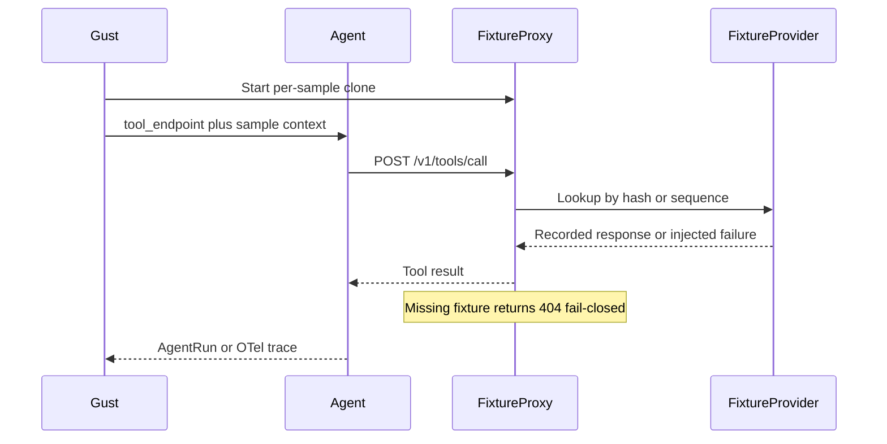

# Mocking and fixtures

Gust is **not** a universal mocking framework. Industry practice is to evaluate trajectories while leaving world control to normal DI, language mocks, WireMock, test containers, or sandboxes. Gust follows that boundary.

## World-control modes

| Mode | Who owns dependencies | When to use |
|------|-----------------------|-------------|
| `existing` (default when no fixtures) | Your harness / QA mocks | Preferred adoption path; no Gust tool routing required |
| `gust` (default when fixtures present) | Gust fixture proxy | Selected tools need deterministic responses or failure injection |

```yaml
environment:
  world_control: existing   # or gust
  fixtures_dir: fixtures    # only needed for gust mode
```

## Gust fixture lifecycle (`world_control: gust`)



1. Load authored/extracted fixture JSON into a `FixtureProvider`.
2. Clone the provider per concurrent sample and bind an ephemeral loopback proxy.
3. Inject `AGENTEVAL_FIXTURE_ENDPOINT` / `tool_endpoint` into the sample adapter.
4. Only tools deliberately routed to `POST {endpoint}/v1/tools/call` are mocked.
5. Match by RFC 8785 argument hash, ordered sequence, or exact-then-sequence.
6. Return the recorded body or inject `slow` / `timeout` / `malformed` / `partial_failure`.
7. Missing fixtures fail closed (HTTP 404). Gust never silently calls production.
8. Failed samples can include a fixture call ledger (matched fixture id, mode, sanitized body).

## Limitations (current milestone)

- Fixture proxy binds **loopback only**. Same-host agents (CI job / laptop) are supported.
- Remote QA must use `world_control: existing` and the customer's own mocks.
- No transparent HTTP/MCP interception and no remote Gust fixture service yet.
- Tools that never call the proxy are unaffected — routing is explicit.

## Production safety

- Unset fixture endpoint → production code paths stay unchanged.
- Configured Gust fixtures with no match → error, not passthrough.
- External side effects require an acknowledged QA/test configuration outside Gust.
