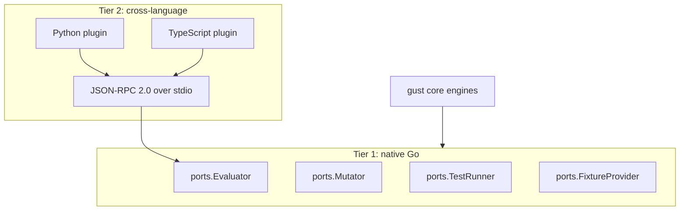

# Extending gust

gust is a hexagonal core: every pluggable capability is a small Go interface in [`internal/ports`](https://github.com/ShadyD45/gust/tree/main/internal/ports), and every built-in is just one implementation of one of them. There is no privileged built-in path — the evaluators that ship with gust use exactly the same interface yours will.

## Pick an extension path

| You want to... | Path | Language | Guide |
|---|---|---|---|
| Assert something the built-in evaluators cannot express | Implement `ports.Evaluator` | Go | [Custom evaluator]() |
| Reuse existing Python/TS validation logic as an evaluator | Tier-2 JSON-RPC plugin | Python, TypeScript, anything | [Wire plugins]() |
| Drive your own agent in Mode 3 | Implement `ports.TestRunner` | Go | [Custom test runner]() |
| Inject new failure classes into mutation testing | Implement `ports.Mutator` | Go | [Adding a mutator](#adding-a-mutator) |
| Serve fixtures from your own store | Implement `ports.FixtureProvider` | Go | [Custom fixture providers](#custom-fixture-providers) |
| Persist scenarios/runs somewhere other than the filesystem | Implement the store ports | Go | [`internal/ports/store.go`](https://github.com/ShadyD45/gust/blob/main/internal/ports/store.go) |

## The two tiers

**Tier 1** is in-process, zero-overhead, and the right choice for anything performance-sensitive (the deterministic suite targets 1,000+ evaluations/second per core).

**Tier 2** trades some latency for language freedom. A plugin is a subprocess that speaks JSON-RPC 2.0 over stdin/stdout, gets a scrubbed environment, and is wrapped in a Go adapter that satisfies the same port. Use it when the logic you need already exists in Python — a schema validator, a domain rules engine, a compliance checker.

## Contracts that apply to every extension

1. **Determinism.** Analyze and Replay must produce bit-identical results across runs. No wall-clock reads, no map iteration order dependence, no network calls in an evaluator.
2. **Structured evidence.** A boolean is not a bug report. Populate `Evidence` with expected vs actual values, span IDs, and diff paths so a failing CI log is actionable.
3. **Typed outcomes.** A mutator that cannot apply must report `skipped`, never a silent pass — skipped mutations would otherwise inflate the detection rate and make your evaluator suite look better than it is.
4. **Never synthesize assertions from behavior.** Anything that generates test artifacts from traces leaves assertions empty for a human. This is structural, not stylistic.
5. **Honor the fixture endpoint.** Runners must route tool calls through the provided endpoint (or `AGENTEVAL_FIXTURE_ENDPOINT`) so tests never reach production systems.

## Architecture background

For the design reasoning behind the ports, registry, and wire protocol, read [Hexagonal design]() and [Extension points](). These guides are the practical how-to; those are the why.

Contributing your extension back upstream: [contributor guide](https://github.com/ShadyD45/gust/blob/main/CONTRIBUTING.md).

