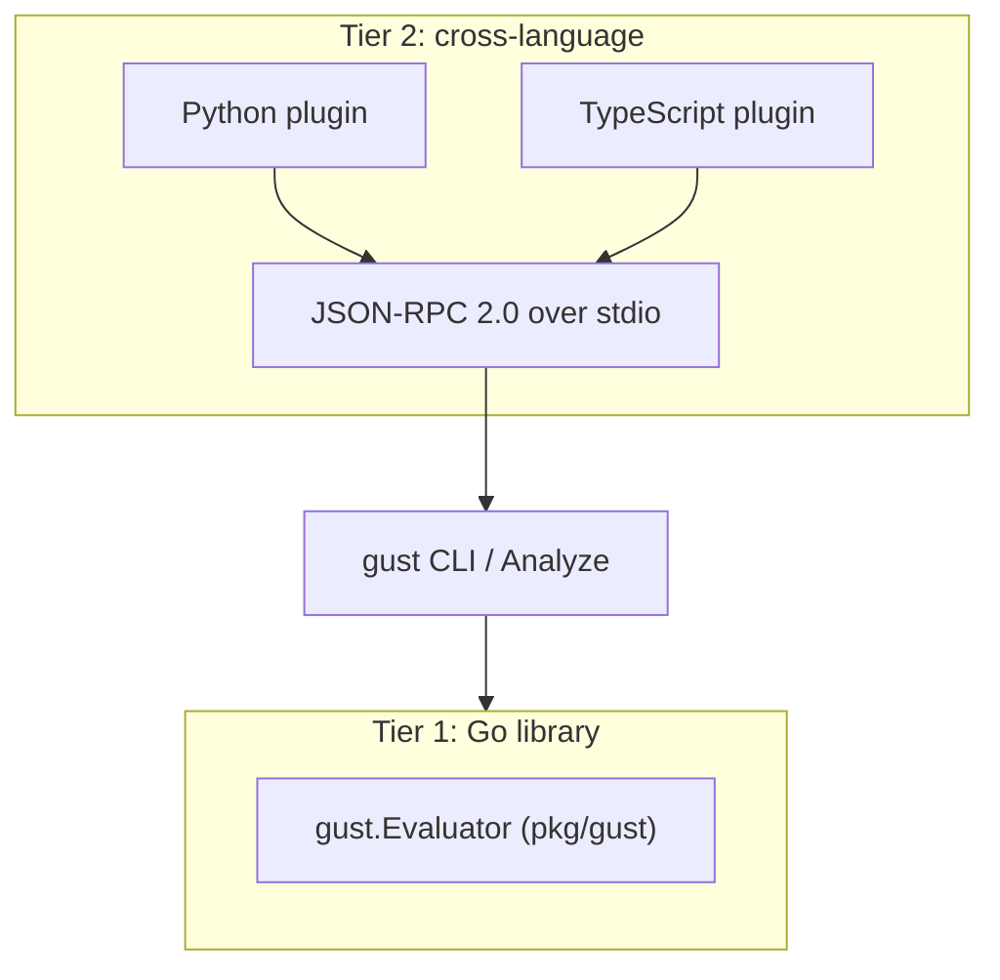

# Extending gust

Gust is designed so you can add domain checks and drive your own agent without forking the binary.

## Pick an extension path

| You want to... | Path | Language | Guide |
|---|---|---|---|
| Assert something the built-ins cannot express (in Go tests) | `gust.Evaluator` via `pkg/gust` | Go | [Custom evaluator]() · [Go library]() |
| Reuse existing Python/TS validation logic as an evaluator | `--plugin` / `gust.yaml` plugins | Python, TypeScript, anything | [Wire plugins]() |
| Drive your own agent in Mode 3 | `gust test --runner http\|exec\|trigger` | any | [Test your agent]() |
| See a complete Mode 3 suite | `./demo/live-agent/run.sh` | Python + gust CLI | [Live-agent demo]() |

## The two tiers

**Tier 1** embeds Analyze in your Go module via [`pkg/gust`](https://github.com/ShadyD45/gust/tree/main/pkg/gust). Stable, in-process, and suitable for ordinary `go test`.

**Tier 2** trades some latency for language freedom. A plugin is a subprocess that speaks JSON-RPC 2.0 over stdin/stdout. Use it when the logic you need already exists in Python or TypeScript.

Application code must not import `gust/internal/...`.

## Contracts that apply to every extension

1. **Determinism.** Analyze and Replay must produce bit-identical results across runs. No wall-clock reads, no map iteration order dependence, no network calls in an evaluator.
2. **Structured evidence.** A boolean is not a bug report. Populate `Evidence` with expected vs actual values, span IDs, and diff paths so a failing CI log is actionable.
3. **Never synthesize assertions from behavior.** Anything that generates test artifacts from traces leaves assertions empty for a human.
4. **Honor the fixture endpoint.** Live Mode 3 agents must route selected tools through fixtures (or your own mocks) so tests never reach production systems.

## Architecture background

For the component model and topologies, read [How Gust works]() and [What Gust is]().

Contributing changes upstream: [contributor guide](https://github.com/ShadyD45/gust/blob/main/CONTRIBUTING.md).
