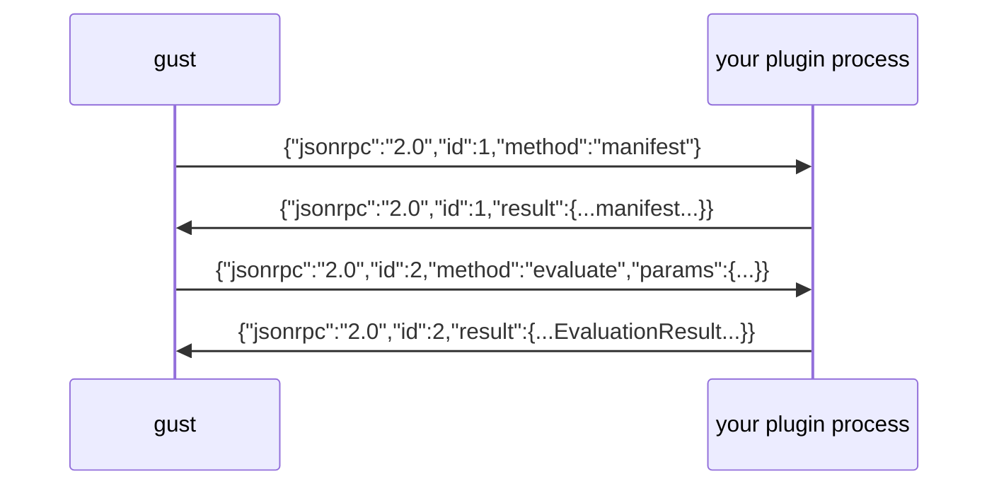

# Cross-language evaluators (Tier-2 wire plugins)

Not every rule belongs in Go. If your validation logic already exists in Python — a pydantic schema, a compliance rules engine, a domain classifier — the Tier-2 wire protocol lets gust call it as a first-class evaluator.

A plugin is a subprocess that speaks JSON-RPC 2.0 over stdin/stdout. gust starts it, handshakes, and wraps it in a Go adapter satisfying `ports.Evaluator`. Your process never needs to know Go exists.

## Protocol

Newline-delimited JSON-RPC 2.0 on stdio. One JSON object per line, no framing headers.



### `manifest`

Called once at startup with a **5 second timeout**. Fail this and the plugin never loads.

```json
{
  "protocol_version": "1.0",
  "kind": "evaluator",
  "name": "pii_leak",
  "version": "1.0.0",
  "description": "Flags unredacted PII in outbound tool arguments",
  "capabilities": ["pii", "compliance"]
}
```

`name` is what assertions reference by `type`, exactly as with a native evaluator.

### `evaluate`

```json
{
  "run": { "schema_version": "0.5", "run_id": "...", "trace": [...], "outcome": {...} },
  "expected": { "id": "no_card_leak", "type": "pii_leak", "tool": "send_email" },
  "context": { "scenario_id": "cancel_latest_order", "environment": {}, "config": {} }
}
```

Return an evaluation result:

```json
{
  "evaluator_name": "pii_leak",
  "evaluator_version": "1.0.0",
  "passed": false,
  "score": 0.0,
  "message": "tool \"send_email\" was called with an unredacted card number",
  "evidence": { "span_id": "s3", "matched_field": "body" },
  "execution_time_ns": 412000
}
```

`expected` may be `null`. Handle it by passing vacuously, never by erroring.

## Runtime environment

gust deliberately constrains plugin processes:

| Constraint | Detail |
|---|---|
| Scrubbed environment | Only the OS baseline needed to start an interpreter is inherited (`PATH`, `HOME`, temp dirs, and the Windows equivalents). Your API keys are *not* passed through. |
| Handshake timeout | 5 seconds for `manifest` |
| Per-call timeout | Bounded by the caller's context; a hung plugin fails the call, not the run |
| Process isolation | Crashes are contained; the process is killed on close |

The scrubbed environment is intentional: an evaluator that needs production credentials is not deterministic and does not belong in a CI gate. If your plugin needs configuration, pass it through `context.config` in the assertion, not the environment.

**stdout is the protocol.** A stray `print()` corrupts the stream. Send all logging to stderr — gust forwards plugin stderr to its own, so tracebacks and log lines show up in your CI output.

## Using the SDK base class

The [Python SDK](https://github.com/ShadyD45/gust/tree/main/sdk/python) handles the transport, the manifest handshake, and error mapping, leaving you one method to implement:

```python
from gust_sdk import EvaluatorPlugin, serve

class RequiresCitation(EvaluatorPlugin):
    name = "requires_citation"
    version = "1.0.0"
    description = "Answers must cite a source document"

    def evaluate(self, run, expected, context):
        output = (run.get("outcome") or {}).get("output", "")
        if "[doc:" not in output:
            return {
                "passed": False,
                "message": "answer has no document citation",
                "evidence": {"output_length": len(output)},
            }
        return {"passed": True}

if __name__ == "__main__":
    serve(RequiresCitation())
```

`EvaluatorPlugin` also provides `tool_spans(run, name=None)` and `tool_arguments(span)` so you are not re-implementing trace traversal in every plugin.

The rest of this page shows the raw protocol, which is what you need if you are writing a plugin in a language without an SDK.

## A complete plugin without the SDK

```python
#!/usr/bin/env python3
"""PII leak evaluator as a gust Tier-2 wire plugin."""
import json
import re
import sys
import time

CARD = re.compile(r"\b(?:\d[ -]*?){13,16}\b")

MANIFEST = {
    "protocol_version": "1.0",
    "kind": "evaluator",
    "name": "pii_leak",
    "version": "1.0.0",
    "description": "Flags unredacted card numbers in outbound tool arguments",
}


def evaluate(params):
    started = time.perf_counter_ns()
    run = params.get("run") or {}
    expected = params.get("expected") or {}
    tool = expected.get("tool") or "send_email"

    result = {
        "evaluator_name": MANIFEST["name"],
        "evaluator_version": MANIFEST["version"],
        "passed": True,
        "score": 1.0,
        "message": f'no unredacted card numbers passed to "{tool}"',
    }

    for span in run.get("trace", []):
        if span.get("type") != "tool" or span.get("name") != tool:
            continue
        args = (span.get("attributes") or {}).get("input") or {}
        if CARD.search(str(args.get("body", ""))):
            result.update(
                passed=False,
                score=0.0,
                message=f'tool "{tool}" was called with an unredacted card number',
                evidence={"span_id": span.get("span_id"), "matched_field": "body"},
            )
            break

    result["execution_time_ns"] = time.perf_counter_ns() - started
    return result


def main():
    for line in sys.stdin:
        line = line.strip()
        if not line:
            continue
        try:
            req = json.loads(line)
        except json.JSONDecodeError:
            continue

        method = req.get("method")
        if method == "manifest":
            payload = {"jsonrpc": "2.0", "id": req.get("id"), "result": MANIFEST}
        elif method == "evaluate":
            try:
                payload = {"jsonrpc": "2.0", "id": req.get("id"),
                           "result": evaluate(req.get("params") or {})}
            except Exception as exc:  # never crash the stream
                payload = {"jsonrpc": "2.0", "id": req.get("id"),
                           "error": {"code": -32603, "message": str(exc)}}
        else:
            payload = {"jsonrpc": "2.0", "id": req.get("id"),
                       "error": {"code": -32601, "message": f"unknown method {method}"}}

        sys.stdout.write(json.dumps(payload) + "\n")
        sys.stdout.flush()   # required: gust reads line by line


if __name__ == "__main__":
    main()
```

A runnable copy of this plugin ships in [`sdk/python/examples/wire_evaluator/`](https://github.com/ShadyD45/gust/tree/main/sdk/python/examples/wire_evaluator) along with a test that exercises the protocol without gust.

## Loading the plugin

Start the process and register the adapter — three lines in your Go entrypoint:

```go
import (
    "gust/internal/adapters/wire"
    "gust/internal/registry"
)

proc, err := wire.StartPlugin(ctx, "python3", "sdk/python/examples/wire_evaluator/plugin.py")
if err != nil {
    return fmt.Errorf("load pii plugin: %w", err)
}
defer proc.Close()

if err := registry.DefaultRegistry.RegisterEvaluator(wire.NewWireEvaluator(proc)); err != nil {
    return err
}
```

The CLI merges registry-registered evaluators with the built-in suite, so your assertions work immediately:

```json
{ "id": "no_card_leak", "type": "pii_leak", "tool": "send_email", "criticality": "hard" }
```

## Testing without gust

The protocol is plain JSON on stdio, so you can test a plugin with a pipe:

```bash
printf '%s\n' '{"jsonrpc":"2.0","id":1,"method":"manifest"}' | python3 plugin.py
```

```json
{"jsonrpc": "2.0", "id": 1, "result": {"protocol_version": "1.0", "kind": "evaluator", "name": "pii_leak", "version": "1.0.0", ...}}
```

That property — debuggable with `printf` and a pipe — is why the protocol is line-delimited JSON rather than a binary RPC.

## Tier-1 or Tier-2?

| | Tier 1 (Go) | Tier 2 (wire) |
|---|---|---|
| Latency | In-process, sub-microsecond | Process hop per call |
| Language | Go only | Anything with stdio |
| Best for | High-volume deterministic checks | Reusing existing logic in another language |

Mode 3 with 200 samples and 5 assertions means 1,000 evaluate calls. Tier 2 handles that fine, but if you are running deterministic checks over large trace corpora, port the hot ones to Tier 1.

## TypeScript

The protocol is language-agnostic. The same shape in Node:

```ts
import readline from "node:readline";

const MANIFEST = {
  protocol_version: "1.0", kind: "evaluator",
  name: "pii_leak", version: "1.0.0",
};

const rl = readline.createInterface({ input: process.stdin });
rl.on("line", (line) => {
  const req = JSON.parse(line);
  const result = req.method === "manifest" ? MANIFEST : evaluate(req.params);
  process.stdout.write(JSON.stringify({ jsonrpc: "2.0", id: req.id, result }) + "\n");
});
```

A packaged TypeScript SDK and framework adapters (LangChain first) are planned; the protocol above is stable and usable today.

