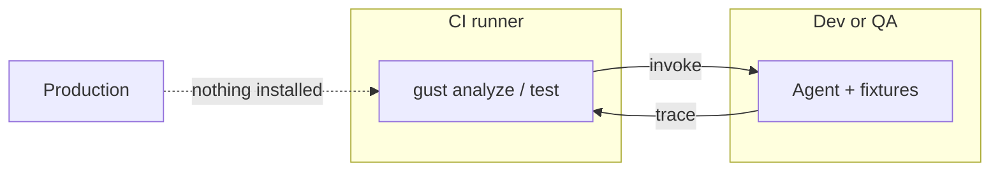

# Running gust in CI

gust is built for CI: one static binary, offline by default, and exit codes that map cleanly onto pipeline decisions.

**gust lives on the CI runner.** The agent under test is the same job (recommended) or a **dev/QA** service. Production does not run gust, does not get a sidecar, and does not export OTLP to CI.



## Exit codes

| Code | Meaning | Typical CI response |
|---|---|---|
| `0` | Gate passed: all `PASS`, or `FLAKY` under `on_flaky: warn` (structured verdict stays `FLAKY`) / `ignore` (structured verdict `PASS`) | Green |
| `1` | `FAIL`, hard constraint violation, or regression | Red — block the merge |
| `2` | Configuration or runtime error (bad path, unparseable input) | Red — fix the pipeline, not the agent |
| `3` | `FLAKY` under `on_flaky: fail` | Red, but distinguishable from a proven failure |

Code `3` exists so you can treat "we cannot prove this is reliable" differently from "this is broken" — for example, blocking the merge but routing to a different alert channel.

## The minimal PR gate

Analyze mode needs no LLM, no network, and no secrets, so it belongs on every pull request:

```yaml
name: agent-behavior
on: [pull_request]

jobs:
  gate:
    runs-on: ubuntu-latest
    timeout-minutes: 10
    steps:
      - uses: actions/checkout@v4
      - uses: actions/setup-go@v5
        with:
          go-version: "1.26"

      - name: Build gust
        run: go build -o gust ./cmd/gust

      - name: Capture agent traces
        run: python scripts/record_traces.py --out runs/    # your recorder

      - name: Gate behavior
        run: |
          for run in runs/*.json; do
            ./gust analyze "$run" --assertions tests/assertions.json --policy policy.yaml
          done
```

If you consume gust from another repository, replace the build step with a download of a released binary and keep everything else identical.

## Reliability gate with a step summary

`gust test` writes a markdown table to `$GITHUB_STEP_SUMMARY` automatically when that variable is set (non-`--json` output), so the verdict shows up on the run page instead of buried in logs:

```yaml
      - name: Reliability gate
        run: ./gust test tests/ --runner synthetic --samples 100 --policy tests/_shared/policy.yaml
```

| Scenario | Samples | Pass Rate | 95% CI | Verdict |
|---|---|---|---|---|
| `cancel_latest_order` | 100 | 100.0% | `[96.3%, 100.0%]` | ✅ **PASS** |

To keep the machine-readable evidence as well, run once with `--json` and upload it:

```yaml
      - name: Reliability gate
        run: ./gust test tests/cancel_order.yaml --samples 100 --policy policy.yaml --json > reliability.json

      - uses: actions/upload-artifact@v4
        if: always()
        with:
          name: gust-reliability
          path: reliability.json
```

## Regression gate against main

Store the main-branch numbers as a baseline artifact, then compare each PR against it:

```yaml
      - name: Download baseline
        uses: actions/download-artifact@v4
        with:
          name: gust-baseline
          path: baseline/
        continue-on-error: true

      - name: Compare
        if: hashFiles('baseline/baseline.json') != ''
        run: ./gust compare baseline/baseline.json candidate.json --policy policy.yaml
```

`baseline.json` and `candidate.json` are the small summary shape described in [Regression comparison](#regression-comparison): `passes`, `samples`, `pass_rate`, `latency_ns`. Generate them from your `--json` reliability output.

## Handling flaky verdicts explicitly

When you set `on_flaky: fail`, branch on the exit code so an inconclusive result reads differently from a proven failure:

```yaml
      - name: Reliability gate
        run: |
          set +e
          ./gust test tests/cancel_order.yaml --samples 100 --policy strict-policy.yaml
          code=$?
          set -e
          case $code in
            0) echo "Gate passed" ;;
            3) echo "::warning::Reliability inconclusive (FLAKY) — raise samples or fix the agent"; exit 1 ;;
            *) echo "::error::Agent behavior gate failed"; exit $code ;;
          esac
```

Simpler alternative, if you do not need the distinction in-pipeline: leave `on_flaky: warn` while adopting, then flip to `fail` once your suite is stable.

## Live agent tests (dev/QA → gust on CI)

Analyze, Replay, Compare, and Mutate never touch the network — run them on every commit. Mode 3 drives a **real agent process** (or a QA URL) and evaluates the traces **in the same job**. That is the only “live push” gust needs.

Nothing is deployed to production. The agent you invoke is:

- the repo checkout on the runner (`--runner exec`), with fixtures instead of prod APIs, or
- a **dev/QA** HTTP service the runner can reach (`--runner http`)

`gust test` starts an in-process OTLP listener and a fixture proxy, then exits. See [Test your agent]().

### Same job — recommended

Agent and gust share localhost. gust injects `OTEL_EXPORTER_OTLP_*` and `AGENTEVAL_INGEST_URL` so an OpenInference / SDK agent can push traces without any extra deploy.

```yaml
  live:
    if: github.event_name == 'push' && github.ref == 'refs/heads/main'
    runs-on: ubuntu-latest
    timeout-minutes: 20
    steps:
      - uses: actions/checkout@v4
      - uses: actions/setup-go@v5
        with:
          go-version: "1.26"
      - uses: actions/setup-python@v5
        with:
          python-version: "3.12"
      - run: go build -o gust ./cmd/gust
      - run: pip install -e sdk/python   # or your agent's deps

      - name: Reliability on the CI agent (not prod)
        run: |
          ./gust test tests/cancel.yaml \
            --runner exec --trace-source otel \
            --samples 20 --policy policy.yaml \
            -- python -m my_agent.sample
```

`--trace-source response` instead of `otel` if the hook prints an `AgentRun` on stdout (the Python `run_sample` helper).

### QA service on the same network

Use this when the agent is already running in **dev/QA** and the CI runner can both *call* it and *receive* OTLP (self-hosted runner or compose in the QA VPC). GitHub-hosted runners have no inbound ports — the QA agent cannot push back to them.

```yaml
      - name: Reliability against QA
        run: |
          ./gust test tests/cancel.yaml \
            --runner http \
            --endpoint "$QA_AGENT_URL" \
            --trace-source otel \
            --otel-listen 0.0.0.0:4318 \
            --samples 20 --policy policy.yaml
        env:
          QA_AGENT_URL: ${{ secrets.QA_AGENT_URL }}
```

gust POSTs `/invoke` with `otel_endpoint` / `ingest_url` / `tool_endpoint`. The QA process exports OTLP or `RunRecorder.export()` to that listener. Point the QA agent's OTEL endpoint at a **hostname the agent can route** (the runner's private DNS), not `0.0.0.0`.

### QA cannot dial CI

Keep gust on the runner; do not open production. Either:

```yaml
      # QA returns the AgentRun on POST /invoke — no push into CI
      - run: ./gust test tests/cancel.yaml --runner http --endpoint "$QA_AGENT_URL" --trace-source response
```

or pull a trace QA already sent to Langfuse (`gust ingest langfuse --trace-id …` then `gust analyze`). Production still does not talk to gust.

## Keeping CI cheap

This repository splits CI into three workflows (Linux-only, free-tier friendly):

| Workflow | What it runs | Summary |
| --- | --- | --- |
| [`test`](https://github.com/ShadyD45/gust/blob/main/.github/workflows/test.yml) | `go test ./...`, Python pytest, TypeScript `npm test` | Per-language pass + log tail |
| [`smoke`](https://github.com/ShadyD45/gust/blob/main/.github/workflows/smoke.yml) | Demo, SDK record→analyze, Mode 3 exec e2e | Checklist of e2e gates |
| [`benchmark`](https://github.com/ShadyD45/gust/blob/main/.github/workflows/benchmark.yml) | `gust-aee report` + mock judge calibrate | Job summary + artifacts; [workflow runs](https://github.com/ShadyD45/gust/actions/workflows/benchmark.yml). Checked-in [`benchmarks/RESULTS.md`](https://github.com/ShadyD45/gust/blob/main/benchmarks/RESULTS.md) is updated locally when needed (no auto PR/push) |

Shared habits:

- `paths-ignore` for docs/images (and RESULTS.md) so doc-only changes do not burn runner minutes.
- `concurrency` with `cancel-in-progress` to kill superseded runs.
- Build the binary once per job and reuse it (`--bin` / `--skip-build`).
- `gust-aee report` and `gust test` append to `$GITHUB_STEP_SUMMARY` automatically when that env var is set.

### Free-tier notes

Public repos get generous Actions minutes; private repos share a monthly pool. Three workflows look like “more CI,” but:

- They run **in parallel**, so wall-clock is closer to the slowest job, not the sum.
- `cancel-in-progress` drops superseded PR pushes.
- Doc-only commits are skipped via `paths-ignore`.
- The benchmark job is read-only (`contents: read`); it does not push or open PRs.
## Other CI systems

Nothing here is GitHub-specific except the step summary. The pattern is always: build or download the binary, run a gust command, let the exit code decide.

```yaml
# GitLab CI
agent-behavior:
  image: golang:1.26
  script:
    - go build -o gust ./cmd/gust
    - ./gust analyze runs/latest.json --policy policy.yaml
```

```groovy
// Jenkins
sh 'go build -o gust ./cmd/gust'
sh './gust analyze runs/latest.json --policy policy.yaml'
```

