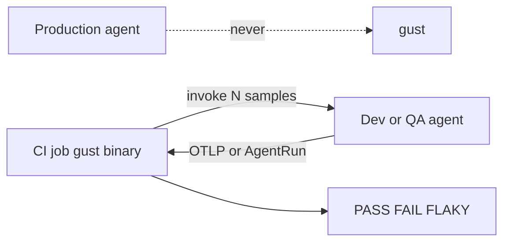

# Using gust

gust answers one question about an LLM agent you already run in production:

> **Does it still do the right thing — reliably — after this change?**

Not "is the final answer good?" but "did it call the right tools, with the right arguments, in the right order, without touching anything forbidden, within its step and latency budget — and how often out of *N* attempts?"

## What you get

| Problem you have today | What gust gives you |
|---|---|
| A prompt/model/tool change silently broke tool selection | `gust analyze` gates captured traces offline in CI, no LLM calls |
| Tests hit real APIs, so CI is slow, flaky, and expensive | `gust replay` re-drives recorded tool I/O deterministically |
| One test run says PASS, the next says FAIL | `gust test` samples *N* times and reports a Wilson confidence interval with `PASS` / `FAIL` / `FLAKY` / `INSUFFICIENT_SAMPLES` |
| "Is this drop real or noise?" | `gust compare` gates a baseline vs candidate pass-rate drop with a significance test |
| Production broke in a way no test covered | `gust scenario from-run` turns a real trace into a test scenario skeleton |
| "Do our assertions actually catch bugs?" | `gust mutate` injects known-bad behavior and measures detection rate |

## Where gust runs

gust is **CI and local test infra**. It is not a production sidecar and not an observability store.



- **gust** starts on the CI runner (or your laptop), listens for traces, evaluates, exits.
- **The agent under test** is the build in that job, or a **dev/QA** service the runner can reach. Tools go through fixtures, not production APIs.
- **Production** keeps its own exporter (Phoenix, Langfuse, a collector). Nothing in prod points at gust.

How to wire the job: [CI integration](). How the agent pushes a trace: [Test your agent]() and [OTel ingestion]().

## Guides

| Page | What it covers |
|------|----------------|
| [Integrate your app]() | Emit an `AgentRun` from your existing Python, TypeScript, or Go service and run your first gate. Start here. |
| [Test your agent]() | Mode 3 against *your* agent via `--runner http` or `--runner exec` — no Go |
| [Live-agent demo]() | Worked example: fixtures, sequence, recovery, forbidden refund, recorded N=20 results |
| [Modes cookbook]() | Recipes per mode, all assertion types, fixtures, and policies |
| [OTel ingestion]() | Point an existing OTLP exporter at gust, or pull a Langfuse trace |
| [CI integration]() | gust on the CI runner; agent in the job or QA; exit codes |
| [Compatibility]() | SDK × schema × CLI and framework adapter versions |
| [LLM judge]() | Opt-in rubric judges, panels, and why LLMs grading LLMs is useful but not gospel |
| [Judge calibration]() | Spearman ρ gate before a judge may fail samples |
| [AEE methodology]() | How the self-benchmark is measured |
| [Benchmarks]() | Metrics explained, latest AEE numbers, more proof |

Custom evaluators, runners, and cross-language plugins: [Extending]().

## The one rule that surprises people

**A trace is not a test.** A captured `AgentRun` is evidence of what happened once. If you auto-generate assertions from what the agent did, you enshrine its current bugs as the specification. gust deliberately refuses to do this — `gust scenario from-run` leaves `assertions: []` for a human to fill in.

## Install

```bash
git clone https://github.com/your-org/gust && cd gust
go build -o gust ./cmd/gust
```

The result is a single static binary with no runtime dependencies. Drop it on a CI runner. Analyze and Replay need no network. Test mode talks only to a **dev/QA** (or in-job) agent — never to production.

## The 60-second version

```bash
# You have a captured run and some assertions about it
./gust analyze testdata/runs/golden_cancel.json --policy testdata/policy.yaml

# Exit code 0 = gate passed, 1 = gate failed. That's your CI step.
echo $?
```

Everything else in these docs is a variation on that: where the run comes from, how many times you sample it, and what policy decides "pass".

A full Mode 3 walkthrough against a tool-calling support agent — including injected 500s and a forbidden refund — is the [live-agent demo]().

