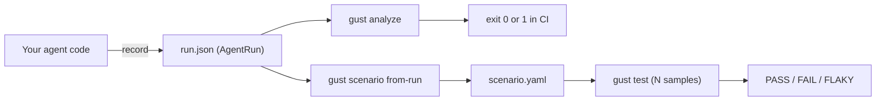

# Integrate gust with your existing agent

This guide takes you from "I have an agent running somewhere" to "a broken tool call fails my CI build." No rewrite required — gust reads a JSON document describing what your agent did.

## The integration in one picture



You only need step one — recording an `AgentRun` — to get value. Everything else consumes that artifact.

When you are ready for Mode 3 (N samples against fixtures), the [live-agent demo]() is the in-tree template: `FixtureClient` + `run_sample` + scenario folders.

## Step 1: Record an AgentRun

An `AgentRun` is a trace: who ran, what was asked, what steps happened, how it ended. The full type lives in [`pkg/api/types.go`](https://github.com/ShadyD45/gust/blob/main/pkg/api/types.go) and the JSON Schema in [`spec/schemas/`](https://github.com/ShadyD45/gust/tree/main/spec/schemas/).

Minimum viable run:

```json
{
  "schema_version": "0.5",
  "run_id": "run-2026-09-06-8f21",
  "agent": { "name": "support-agent", "version": "1.4", "git_commit": "abc1234" },
  "task": { "id": "refund-001", "input": "Cancel my latest order" },
  "trace": [
    {
      "span_id": "s1",
      "name": "get_orders",
      "type": "tool",
      "start_time": "2026-09-06T10:00:00Z",
      "end_time": "2026-09-06T10:00:00.010Z",
      "attributes": {
        "input": { "customer_id": 42 },
        "output": [{ "id": 122, "status": "DELIVERED" }, { "id": 123, "status": "PROCESSING" }]
      },
      "status": { "code": "ok" }
    },
    {
      "span_id": "s2",
      "name": "cancel_order",
      "type": "tool",
      "start_time": "2026-09-06T10:00:00.015Z",
      "end_time": "2026-09-06T10:00:00.025Z",
      "attributes": { "input": { "order_id": 123 }, "output": { "ok": true } },
      "status": { "code": "ok" }
    }
  ],
  "outcome": { "status": "completed", "output": "Order 123 cancelled successfully." }
}
```

Field rules that matter (enforced by `AgentRun.Validate`):

| Field | Requirement |
|---|---|
| `schema_version` | Must be exactly `"0.5"` |
| `run_id`, `agent.name`, `agent.version`, `task.id`, `task.input` | Required, non-empty |
| `outcome.status` | One of `completed`, `failed`, `timeout`, `cancelled` |
| `trace[].span_id`, `trace[].name` | Required, non-empty |
| `trace[].type` | `agent`, `llm`, `tool`, `retrieval`, `memory`, `plan`, `error` |

Two conventions carry all the assertion weight:

- **Tool calls must be spans with `"type": "tool"`.** Every evaluator that reasons about tools filters on this. An LLM span named `get_orders` is invisible to tool assertions.
- **Tool arguments go in `attributes.input` as an object.** `tool_call` assertions with `arguments` compare against exactly this map.

### Python

No dependencies needed — this is a dict and a `json.dump`. (A packaged helper lives in [`sdk/python`](https://github.com/ShadyD45/gust/tree/main/sdk/python); see [Using the Python SDK](#step-5-optional-use-the-python-sdk).)

```python
import json, uuid
from datetime import datetime, timezone

def now():
    return datetime.now(timezone.utc).isoformat().replace("+00:00", "Z")

spans, i = [], 0

def record_tool(name, args, output, error=None):
    """Call this from your existing tool-dispatch wrapper."""
    global i
    i += 1
    started = now()
    spans.append({
        "span_id": f"s{i}",
        "name": name,
        "type": "tool",
        "start_time": started,
        "end_time": now(),
        "attributes": {"input": args, "output": output},
        "status": {"code": "error", "message": error} if error else {"code": "ok"},
    })

# ... your agent runs, calling record_tool() for each tool invocation ...

run = {
    "schema_version": "0.5",
    "run_id": str(uuid.uuid4()),
    "agent": {"name": "support-agent", "version": "1.4"},
    "task": {"id": "refund-001", "input": user_message},
    "trace": spans,
    "outcome": {"status": "completed", "output": final_answer},
}

with open("run.json", "w") as f:
    json.dump(run, f, indent=2)
```

Where to hook in depends on your stack, but it is always the same place — wherever tool results come back:

- **LangChain**: a `BaseCallbackHandler` with `on_tool_start` / `on_tool_end` / `on_tool_error`.
- **OpenAI/Anthropic function calling loops**: your `for tool_call in response.tool_calls:` dispatch loop.
- **LlamaIndex / CrewAI / AutoGen**: their respective tool callback or observer hooks.

If you would rather not write a recorder at all and you already emit OpenTelemetry spans, point `OTEL_EXPORTER_OTLP_ENDPOINT` at gust **in CI or on a laptop** — see [OTel ingestion](). You can also `RunRecorder.export()` an AgentRun to `POST /v1/runs`. Do not point production at gust.

### TypeScript / Node

```ts
import { writeFileSync } from "node:fs";

type Span = {
  span_id: string;
  name: string;
  type: "tool" | "llm" | "agent" | "error";
  start_time: string;
  end_time: string;
  attributes: Record<string, unknown>;
  status: { code: "ok" | "error"; message?: string };
};

const spans: Span[] = [];

export async function tracedTool<T>(
  name: string,
  args: Record<string, unknown>,
  fn: () => Promise<T>,
): Promise<T> {
  const start = new Date().toISOString();
  try {
    const output = await fn();
    spans.push({
      span_id: `s${spans.length + 1}`, name, type: "tool",
      start_time: start, end_time: new Date().toISOString(),
      attributes: { input: args, output }, status: { code: "ok" },
    });
    return output;
  } catch (err) {
    spans.push({
      span_id: `s${spans.length + 1}`, name, type: "tool",
      start_time: start, end_time: new Date().toISOString(),
      attributes: { input: args }, status: { code: "error", message: String(err) },
    });
    throw err;
  }
}

export function writeRun(path: string, taskInput: string, output: string) {
  writeFileSync(path, JSON.stringify({
    schema_version: "0.5",
    run_id: crypto.randomUUID(),
    agent: { name: "support-agent", version: "1.4" },
    task: { id: "refund-001", input: taskInput },
    trace: spans,
    outcome: { status: "completed", output },
  }, null, 2));
}
```

### Go

Import the public types directly — no serialization guesswork:

```go
import "gust/pkg/api"

run := api.AgentRun{
    SchemaVersion: api.SchemaVersion,
    RunID:         "run-2026-09-06-8f21",
    Agent:         api.AgentInfo{Name: "support-agent", Version: "1.4"},
    Task:          api.TaskInfo{ID: "refund-001", Input: userMessage},
    Trace: []api.Span{{
        SpanID:     "s1",
        Name:       "cancel_order",
        Type:       api.SpanTypeTool,
        StartTime:  start,
        EndTime:    end,
        Attributes: map[string]any{"input": map[string]any{"order_id": 123}},
        Status:     api.SpanStatus{Code: "ok"},
    }},
    Outcome: api.RunOutcome{Status: "completed", Output: finalAnswer},
}
if err := run.Validate(); err != nil { /* fail fast in your recorder, not in CI */ }
```

You can also embed the engines instead of shelling out to the binary — see [Embedding gust as a Go library](#embedding-gust-as-a-go-library).

## Step 2: Declare what "correct" means

Assertions are the test. They are deliberately written by a human, not derived from the trace.

For a quick start, attach them to the run under `metadata.assertions` — `gust analyze` picks them up automatically:

```json
"metadata": {
  "assertions": [
    { "id": "a1", "type": "task_success", "parameters": { "expected_output": "cancelled" } },
    { "id": "a2", "type": "tool_call", "tool": "cancel_order", "arguments": { "order_id": 123 } },
    { "id": "a3", "type": "forbidden_tool_call", "tool": "issue_refund", "criticality": "hard" },
    { "id": "a4", "type": "max_steps", "limit": 6 }
  ]
}
```

For anything long-lived, keep assertions in a separate file so your production recorder never carries test logic:

```bash
./gust analyze run.json --assertions tests/cancel_order.assertions.json
```

That file is a plain JSON array of the same objects. The full catalogue of the nine assertion types and their fields is in the [assertion catalogue](#assertion-catalogue).

## Step 3: Gate it

```bash
./gust analyze run.json --policy policy.yaml
```

```text
Analyze run-2026-09-06-8f21 → PASS (4 assertions, 182375 ns)
  ✓ task_success: task completed successfully
  ✓ tool_arguments: tool arguments matched expected specifications
  ✓ forbidden_tool: no forbidden tool "issue_refund" was called
  ✓ max_steps: step count 2 within budget of 6
```

Exit code `0` on pass, `1` on failure — drop it straight into a CI step. Add `--json` when you want to archive the evidence:

```bash
./gust analyze run.json --json > analyze-report.json
```

Each result carries an `evidence` object (expected vs actual tools, argument diffs with paths, offending `span_id`), which is what makes a failing CI log actionable instead of "assertion failed".

## Step 4: Go from one run to a reliability gate

One run is a coin flip. When you want a number you can gate on, promote the trace to a scenario and sample it:

```bash
# Extract the skeleton — task and candidate fixtures are filled in, assertions are NOT
./gust scenario from-run run.json --output tests/cancel_order.yaml
```

Open the file, write the assertions, then:

```bash
./gust test tests/ --runner synthetic --samples 100 --policy policy.yaml
```

```text
Scenario: cancel_latest_order
  97/100 passed  (observed pass rate: 97.0%)
  95% confidence interval: [91.5%, 99.0%]

VERDICT: [?] FLAKY (Inconclusive)
```

That verdict is the point: at 100 samples with a 95% floor, 97% observed is *not* enough evidence to call it passing. Details on runners, sample sizing, and what each verdict means are in [Mode 3: Test](#mode-3-test).

## Step 5 (optional): Use the Python SDK

If you are in Python, [`sdk/python`](https://github.com/ShadyD45/gust/tree/main/sdk/python) packages the recorder above so you do not maintain span plumbing yourself:

```bash
pip install -e sdk/python
```

```python
from gust_sdk import RunRecorder

rec = RunRecorder(agent_name="support-agent", agent_version="1.4",
                  task_id="refund-001", task_input=user_message)

with rec.tool("get_orders", {"customer_id": 42}) as span:
    span.output = get_orders(customer_id=42)

with rec.tool("cancel_order", {"order_id": 123}) as span:
    span.output = cancel_order(order_id=123)

rec.complete(output=final_answer)
rec.write("run.json")
```

The SDK captures and invokes; the Go binary remains the evaluation authority. Full reference: [Python SDK](https://github.com/ShadyD45/gust/blob/main/sdk/python/README.md).

## Where to go next

- Sample *your* live agent N times in CI / QA (not prod): [Test your agent]()
- Recipes for every mode, fixture matching, and failure injection: [Modes cookbook]()
- Already emitting OTel spans: [OTel ingestion]()
- Wire the gate into GitHub Actions: [CI integration]()
- Write your own evaluator: [Custom evaluator]()

