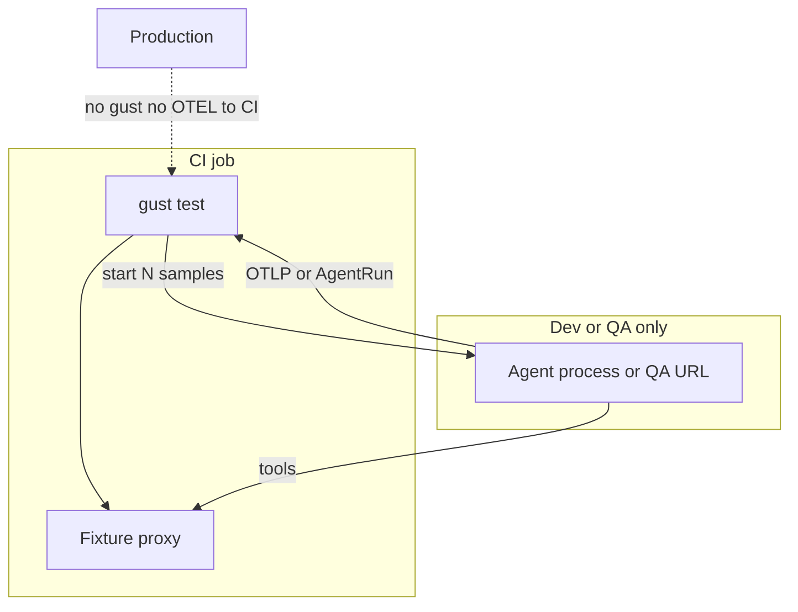

# Test your own agent (Mode 3)

You do not write Go and you do not fork gust. You keep a one-sample hook in **your** repo. gust starts a fixture proxy, calls that hook N times, and collects each trace by a per-sample id.

If you only need to gate one captured run, use [`analyze`]() instead. This page is for reliability sampling: *is today's live agent reliable on this scenario?*

A complete worked example — scripts, fixtures, assertions, and recorded N=20 results — is the [live-agent demo](). Copy that folder shape; swap in your hook.

## Where this runs (not production)

Mode 3 is a **CI (or laptop) session**. gust is the evaluator; the agent under test is a **dev/QA** build. Production does not run gust and does not export to it.



| Topology | When to use | How traces reach gust |
|---|---|---|
| **Same CI job** (`--runner exec`) | Default. Agent code + fixtures in the pipeline. | gust injects `OTEL_*` / `AGENTEVAL_INGEST_URL` on localhost and Wait()s |
| **QA on the same network** (`--runner http`) | Self-hosted runner or compose in the QA VPC so the agent can dial gust | Invoke body carries `otel_endpoint`; agent exports OTLP or `POST /v1/runs` |
| **QA cannot reach the CI runner** | GitHub-hosted runners have no inbound ports | Agent returns an `AgentRun` on `/invoke` (`--trace-source response`), or CI pulls from Langfuse |

Do not run `gust ingest otel serve` as a production sidecar. That turns gust into a store. Full job YAML: [CI integration]().

## 1. Instrument the agent

Record an `AgentRun` with the [Python SDK](https://github.com/ShadyD45/gust/tree/main/sdk/python), the [TypeScript SDK](https://github.com/ShadyD45/gust/tree/main/sdk/typescript), or point an existing OTel exporter at gust — see [OTel ingestion](). Route tools through `FixtureClient` so Mode 3 never hits **production APIs** (the agent itself is still the real code, running in CI or QA).

```python
from gust_sdk import FixtureClient, RunRecorder

fixtures = FixtureClient()  # AGENTEVAL_FIXTURE_ENDPOINT

def get_orders(customer_id):
    if fixtures.enabled:
        return fixtures.call("get_orders", {"customer_id": customer_id})
    return orders_api.list(customer_id)
```

## 2. Expose one sample

### Exec — gust starts the process

```python
from gust_sdk import run_sample

def handle(request, fixtures):
    rec = RunRecorder(agent_name="support-agent", agent_version="1.4",
                      task_input=request.get("input") or "")
    # ... run the agent once, using fixtures.call for tools ...
    rec.complete(output="done")
    return rec

if __name__ == "__main__":
    run_sample(handle)
```

```bash
gust test tests/cancel.yaml --runner exec -- python -m my_agent.sample
```

gust writes the scenario JSON on stdin and sets `AGENTEVAL_FIXTURE_ENDPOINT`, `AGENTEVAL_SAMPLE_ID`, and (when the in-process receiver is up) the `OTEL_EXPORTER_OTLP_*` / `AGENTEVAL_INGEST_URL` variables. Your process can print one `AgentRun` on stdout, `RunRecorder.export()` it, or emit OTLP.

### HTTP — gust POSTs to a running service

```python
from gust_sdk import serve_sample
serve_sample(handle, port=8080).serve_forever()
```

```bash
gust test tests/cancel.yaml --runner http --endpoint http://localhost:8080
```

POST `/invoke` body:

```json
{
  "input": "Cancel my latest order",
  "context": {},
  "tool_endpoint": "http://127.0.0.1:49152",
  "sample_id": "cancel_latest_order-…",
  "otel_endpoint": "http://127.0.0.1:4318",
  "ingest_url": "http://127.0.0.1:4318/v1/runs"
}
```

Respond with an `AgentRun`, or write a file / export OTel and tell gust how to collect it.

## 3. Collect the trace

| `--trace-source` | What gust uses |
|---|---|
| `auto` (default) | Valid `AgentRun` on the HTTP body / stdout, else `{trace-path}`, else the in-process OTLP buffer |
| `response` | HTTP body or exec stdout must be an `AgentRun` |
| `file` | Read `{--trace-path}` as AgentRun JSON. Use `{sample_id}` in the path. |
| `otel-file` | Read `{--trace-path}` as OTLP JSON and map it |
| `otel` | Wait on the in-process receiver for `gust.sample_id` (or the only in-flight sample) |

`--runner exec|http` with `auto` or `otel` starts OTLP/HTTP + gRPC for you. `--otel-listen` is only needed to pin the port.

```bash
gust test tests/cancel.yaml --runner exec --trace-source otel -- python -m my_agent
gust test tests/cancel.yaml --runner http --endpoint http://localhost:8080 --trace-source otel
```

Concurrent samples cannot share one `run.json`. Stamp `AGENTEVAL_SAMPLE_ID` on `run_id` / `metadata.sample_id`, or rely on the injected `OTEL_RESOURCE_ATTRIBUTES`. The SDKs do this automatically.

## 4. Authoring scenarios

Keep the **document** (a reviewed `TestScenario`). Do not put fixture bodies and shared assertions in one YAML.

```text
tests/
  _shared/
    assertions/cancel.yaml
    policy.yaml
  cancel_latest/
    scenario.yaml          # task, refs, reliability, optional runner
    fixtures/
      fx_get_orders_001.json
      fx_cancel_order_001.json
```

`scenario.yaml` stays thin:

```yaml
id: cancel_latest
version: "1.0"
description: "Cancel the latest processing order"
task:
  id: refund-001
  input: "Cancel my latest order"
environment:
  fixtures: []
  fixtures_dir: fixtures          # or omit; a sibling fixtures/ is loaded automatically
assertion_files:
  - ../_shared/assertions/cancel.yaml
assertions:
  - $ref: ../_shared/assertions/extra.yaml   # spliced in place
  - id: max_8
    type: max_steps
    limit: 8
reliability:
  samples: 20
  minimum_pass_rate: 0.95
  confidence: 0.95
runner:
  type: exec
  command: ["python", "-m", "my_agent.sample"]
  traces:
    source: response
```

CLI flags override `runner`. One file still works: `gust test tests/cancel.yaml`.

```bash
gust test tests/ --policy tests/_shared/policy.yaml
```

discovers every `scenario.yaml` under the tree (skips `_shared`) and any top-level `*.yaml` that looks like a scenario. One fixture proxy and one OTel listener cover the suite; each scenario gets its own fixtures so cases cannot bleed.

`gust scenario from-run run.json --layout dir --output tests/new_case/` writes this folder shape with empty assertions.

`gust test` always starts fixture proxies from resolved fixtures and `--fixtures`. Each sample clones a clonable provider and gets an ephemeral mock-tool proxy so ordered sequences cannot interleave under concurrency. If a provider cannot be cloned, the sampler caps concurrency to 1.

No gust process in production; the job is the listener. See [CI integration]().

The [live-agent demo]() is this layout in-tree (`healthy/`, `recovery/`, `buggy/`, `unsafe/`) with `run.sh` / `run.ps1` wrapping `gust test`.

## Agent failures vs infrastructure errors

A failed agent run is `outcome.status: "failed"` and counts toward the Wilson interval. If the hook crashes, returns invalid JSON, or the fixture proxy is unreachable, the whole sampling run aborts.

## Embedders only

Implementing `ports.TestRunner` in Go is for people who embed gust as a library. That path is documented in [Custom test runner]().
